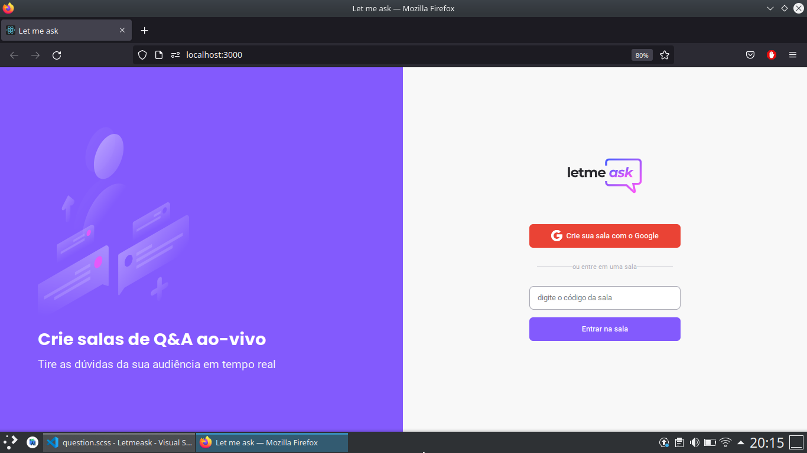
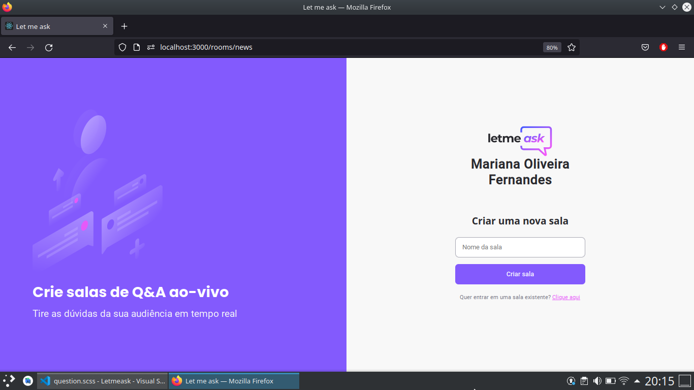
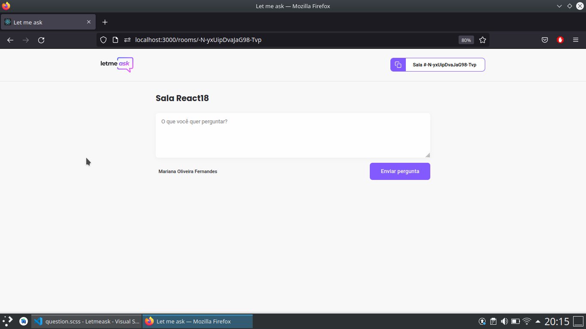
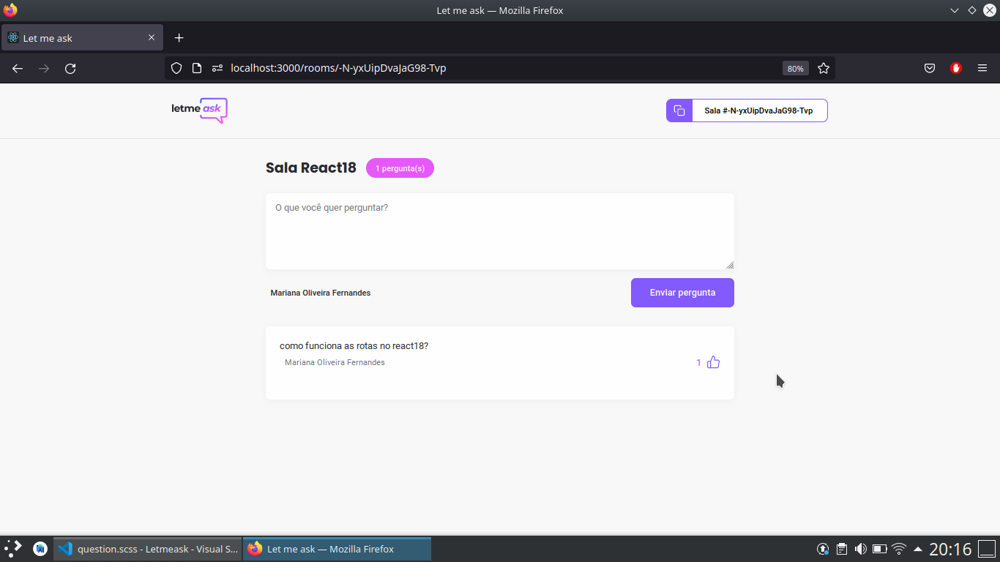
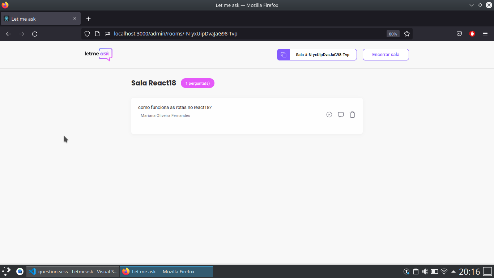

# Let me ask

## 💻 Projeto

Aplicação desenvolvida durante Next Level Week (nlw) Together da Rocketseat, que consiste em criar uma sala, fazer perguntas e os demais usuários responderem sobre o assunto 

- Cadastro como usuário
  - Criar uma pergunta
  - da like nas perguntas

- Cadastro admin
  - Criar uma sala
  - Excluir, marcar como respondida e da preferência nas perguntas
  - Encerrar sala

## 🌐 Preview

 
    
Tela de Home 

    

 
    
Tela de criar sala 

    

 
    
Tela de sala criada 

    

 
    
Tela de pergunta 

    

 
    
Tela de visão de amdin 

    

 

## 🚀 Tecnologias

Esse projeto foi desenvolvido com as seguintes tecnologias:

- ReactJs
- Firebase
- Typescript
- SCSS
